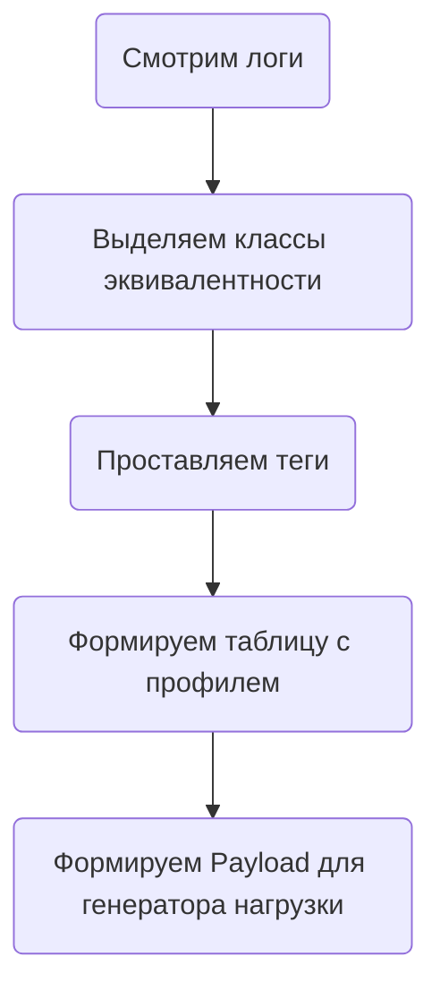

# Анализ логов для котиков



## Linux way

1) Смотрим логи
   Утилиты:

   ```bash
   cat - Читаем весь файл в Консоль
   zcat - Для файлов в .gz архиве
   grep - Ищем конкретные вхождения
   awk - Используем для парсинга
   ```

Примеры скриптов:

### Получаем все доступные запросы

```bash
cat access.log|awk -F '|' '{print $4}'
```

### Сколько тех или иных хендлеров в наличии в файле - первичный профиль

```bash
  cat access.log|awk -F '|' '{print $4}'|awk -F'?' '{print $1}'|awk -F' ' '{print $2}' |sort|uniq -c|sort -nr 
```

### Примеры составления регулярных выражений

```bash
  cat access.log|grep -E '^.*/post .*[aA]ction1'   
```

```bash
   cat access.log|grep -E '^.*.GET / HTTP/1.1'   
```

### Пайплайн филтрации

[parse_api](./linux-way/scripts/parse_api) - Скрипт для парсинга логов в промежуточный формат.

Пример:
```bash
 ./linux-way/scripts/parse_api -i ./linux-way/files/access.log -o ./linux-way/files/prepared.txt
```

[payload_generator.py](./linux-way/scripts/payload_generator.py)  - Пример генератора payload из промежуточного формата
в jsonline

Пример генерации payload из промежуточного файла:

```bash
python3 ./scripts/payload_generator.py ./files/prepared.txt ./files/payload.json
```

## Data-science-way

TBD

## Clickhouse Way

### Порядок установки

#### Развернем Clickhouse

```bash
docker-compose -f ./docker-compose/docker-compose.yml  up clickhouse-01 -d
```

#### Выполним скрипты в папке ./clickhouse-way/

1. [1_CreateDictionary.sql](./clickhouse-way/sql/1_CreateDictionary.sql) - Скрипт создания таблицы со словарем
   регулярных выражений расположенным в [regexp_dictionary.yaml](./docker-compose/clickhouse/user_files/regexp_dictionary.yaml)`
2. [2_CreateTable_v2.sql](./clickhouse-way/sql/2_CreateTable_v2.sql) - Скрипт создания таблицы с автоматическим
   тегированием через Словарь регулярных выражений.
3. [3_CreateAggregatesView.sql](./clickhouse-way/sql/3_CreateAggregatesView.sql) - Скрипт создания MaterializedViews для
   Ответов в секунду.
4. [4_create_aggregates_views_hits.sql](./clickhouse-way/sql/4_create_aggregates_views_hits.sql) - Скрипто создания
   MaterializedViews для Запросов в секунду.

Дополнительно можно посмотреть:
[Пример - CreateTable_v1.sql](./clickhouse-way/sql/Пример%20-%20CreateTable_v1.sql) - Скрипт создания таблицы с тегированием через multi-if
[Пример - Запрос агрегатов.sql](./clickhouse-way/sql/Пример%20-%20Запрос%20агрегатов.sql) - Пример как запрашивать данные из MV с AggregatedMergeTree.
[Пример - Расчет профиля нагрузки.sql](./clickhouse-way/sql/Пример%20-%20Расчет%20профиля%20нагрузки.sql) - Пример скрипта - который считает 95 квантить посекундной интенсивности за
промежуток времени. Это простой и вырожденный пример.
В реальности могут быть более сложные рассчеты - например - среднее за минуту. Или даже час.
[Пример - Технические запросы.sql](./clickhouse-way/sql/Пример%20-%20Технические%20запросы.sql) - Пример запросов - для проверки эффективности пожатия данных.
[Пример - Обновление данных.sql](./clickhouse-way/sql/Пример%20-%20Обновление%20данных.sql) - Пример Alter table update.

#### Описание скриптов

1. [clickhouse_file_inserter.py](./clickhouse-way/scripts/clickhouse_file_inserter.py) - Пример
   скрипта для ручной заливки файла.
2. [clickhouse_payload_preparer.py](./clickhouse-way/scripts/clickhouse_payload_preparer.py) -
   Пример скрипта - который считает профиль и формирует на его основе Payload в
   формате [HTTP_JSON](https://yandex.cloud/en/docs/load-testing/concepts/payloads/http-json)

Запуск остальной оснастки:
```bash
docker-compose -f ./docker-compose/docker-compose.yml  up -d
```
Дополнительно:
Для использования итоговым файлом в НТ - его надо зашафлить. 

